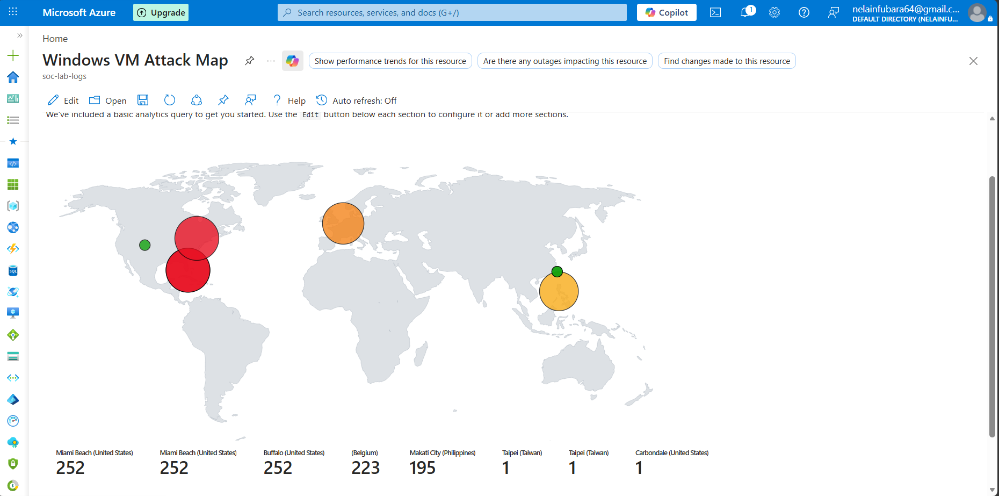

# Cloud Honeypot Global Threat Monitoring using Azure Sentinel
A live cloud honeypot deployed in Microsoft Azure, utilizing a custom PowerShell script and Microsoft Sentinel (SIEM) to map global RDP brute-force attacks in real-time.

## Objective
The primary objective of this project is to deploy a live honeypot within Microsoft Azure to observe, analyze, and map real-world RDP brute-force attacks. By intentionally provisioning a vulnerable Windows Virtual Machine with exposed network security groups, the lab captures live threat intelligence. A custom PowerShell script extracts attacker IP addresses from Windows Event Logs, enriches the data via a third-party Geolocation API, and forwards it to a Log Analytics Workspace. Finally, Microsoft Sentinel (SIEM) is utilized to visualize the attack origins on a global dashboard, demonstrating the speed, scale, and geographic distribution of automated cyber attacks against unsecured cloud infrastructure.

## Architecture & Technology Stack
- **Cloud Platform:** Microsoft Azure
- **Security Information and Event Management (SIEM):** Microsoft Sentinel
- **Data Enrichment:** Azure Sentinel Watchlists (CSV Geolocation Data)
- **Log Management:** Log Analytics Workspace
- **Compute:** Windows 10 Virtual Machine (Vulnerable Configuration)
- **Scripting & Automation:** PowerShell
- **Query Language:** Kusto Query Language (KQL)

## Methodology

### 1. Intentional Vulnerability Deployment
To capture live threat intelligence, a Windows 10 Virtual Machine was deployed in Microsoft Azure and deliberately stripped of standard security controls to act as a honeypot. The Azure Network Security Group (NSG) was heavily modified; default restrictive rules were replaced with a custom inbound rule (`Danger_AllowAnyCustomInbound`) permitting unrestricted traffic from any source IP on all ports. Additionally, the local Windows Defender Firewall was disabled. This highly vulnerable state ensured the VM was immediately discoverable by automated internet scanners, allowing RDP brute-force attempts to successfully reach the operating system and generate the critical Windows Event Logs (specifically Event ID 4625) required for analysis.

### 2. Log Ingestion & IP Extraction
A custom PowerShell script was deployed directly onto the honeypot to run continuously. This script was designed to monitor the local Windows Event Viewer specifically for Event ID 4625 (Failed Logon). Upon detecting a brute-force attempt, the script automatically parsed the raw log text, extracted the attacker's source IP address, and wrote it to a custom log file, which was then ingested by the Azure Log Analytics Workspace.

### 3. SIEM Configuration & Geolocation Enrichment
To map the attacks globally, a static CSV file containing global IP-to-location mappings was uploaded directly into Microsoft Sentinel as a Watchlist. Utilizing Kusto Query Language (KQL), a query was written to perform a dynamic lookup, joining the incoming failed RDP logs with the geographic data in the Watchlist. This enrichment process mapped each attacker's IP to specific latitude and longitude coordinates, allowing Sentinel to plot the attacks in real-time on a visual workbook dashboard.

## Findings & Results
The honeypot was discovered and engaged by automated internet scanners within 10 minutes of deployment. Over a 4-hour period, the Log Analytics Workspace ingested 672 failed RDP login attempts.

By mapping these events in Microsoft Sentinel, several distinct geographic hotspots emerged. The majority of the brute-force attacks originated from Miami Beach (United States) and Buffalo (United States), utilizing common default usernames such as `Administrator`, `Admin`, and `Office` in their dictionary attacks.

This exercise effectively demonstrates the severe speed at which unsecured cloud resources are targeted by global threat actors. It underscores the absolute necessity of robust Identity and Access Management (IAM), strict Network Security Group (NSG) configurations, and continuous SIEM monitoring in enterprise environments.

### Attack Map Dashboard

*The map above visualizes the global distribution of RDP brute-force attacks directed at the honeypot over the observation period.*
